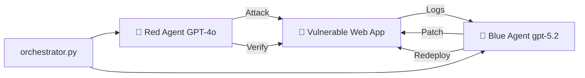

<div align="center">

# 🤖⚔️ AI Red Team vs Blue Team Lab

<p align="center">
  
  
  
  
  
</p>

<p align="center">
  <b>Two autonomous AI agents. One attacks. One defends. Complete self-healing loop in under 2 minutes.</b>
</p>

</div>

---

# ⚡ The Numbers That Matter

| Metric                                   | Value                      |
| ---------------------------------------- | -------------------------- |
| 🏗️ App built & deployed                 | ~15 seconds                |
| 💥 Full attack cycle (nmap → SQLi → XSS) | **70 seconds**             |
| 🛡️ Patch generated & redeployed         | ~30 seconds                |
| ✅ Autonomous Re-test & Verification      | ~15 seconds                |
| ⏱️ **Total End-to-End Cycle**            | **< 2 minutes**            |
| 💰 **Total API Token Cost**              | **~$0.08**                 |
| 👤 Human Intervention                    | **Zero (100% Autonomous)** |

---

# 🎯 What This Is

A fully automated **AI Security Research Lab & Self-Healing Pipeline** where:

* 🔵 **Blue Agent (`gpt-5.2`)**

  * Builds a deliberately vulnerable Flask + SQLite application
  * Deploys it inside Docker containers
  * Generates remediation patches

* 🔴 **Red Agent (`GPT-4o`)**

  * Performs reconnaissance
  * Executes vulnerability discovery
  * Generates attack intelligence reports

* 🔄 **Closed Feedback Loop**

  * Feeds attack findings back into Blue Agent
  * Rewrites vulnerable source code
  * Rebuilds infrastructure
  * Performs automated re-testing

* 🏁 **Verification Stage**

  * Re-launches Red Agent
  * Attempts bypass testing
  * Produces final security validation

---

# 🏗️ Architecture & Core Pipeline


---

# 🚀 Quick Start

## Prerequisites

* Kali Linux (or Linux with `nmap` + `sqlmap`)
* Docker & Docker Compose
* Azure OpenAI account
* Python 3.11+

---

## 1. Clone & Setup

```bash
git clone https://github.com/YOUR_USERNAME/autonomous-ai-red-blue-lab.git

cd autonomous-ai-red-blue-lab

python3 -m venv venv

source venv/bin/activate

pip install -r requirements.txt
```

---

## 2. Configure Environment Variables

```bash
cp .env.example .env

nano .env
```

Configure:

* Azure OpenAI API Key
* Endpoint
* Deployment names

---

## 3. Execution Modes

### ⚡ Option A — Fully Autonomous Closed Loop

```bash
python3 orchestrator.py
```

Runs:

1. Target generation
2. Attack execution
3. Patch generation
4. Docker rebuild
5. Security verification

---

### 🛠️ Option B — Step-by-Step Mode

Deploy:

```bash
cd webapp
docker compose up -d --build
cd ..
```

Execute attack:

```bash
python3 red_agent/red_agent.py
```

Generate patch:

```bash
python3 blue_agent/blue_agent.py
```

Redeploy:

```bash
cd webapp
docker compose down
docker compose up -d --build
cd ..
```

Verification:

```bash
bash red_agent/retest.sh
```

---

# 📊 Real-Time Verification Output

```md
### Security Analysis Report

SQL Injection:
❌ BLOCKED

Stored XSS:
❌ BLOCKED

System Defense Rating:
🛡️ SECURE
```

---

# 📁 Project Structure

```text
autonomous-ai-red-blue-lab/
│
├── README.md
├── orchestrator.py
├── requirements.txt
├── .env.example
├── test_connection.py
├── writeup.md
│
├── webapp/
│   ├── app.py
│   ├── Dockerfile
│   └── docker-compose.yml
│
├── red_agent/
│   ├── red_agent.py
│   └── attack.sh
│
├── blue_agent/
│   └── blue_agent.py
│
└── logs/
    ├── red_team_report.txt
    ├── ai_red_analysis.txt
    ├── blue_patch_report.txt
    └── retest_report.txt
```

---

# 💡 Key Technical Findings

Vulnerabilities discovered and exploited automatically were remediated and redeployed within seconds.

The pipeline demonstrates:

* Autonomous discovery
* Autonomous remediation
* Container rebuilding
* Continuous validation

---

# ⚠️ Disclaimer

This project exists solely for:

* Security research
* Controlled education
* Local isolated environments

Do **NOT** deploy or execute against unauthorized targets.

---

# 🤝 Contributing & Future Roadmap

* [ ] Automated CSRF mitigation
* [ ] Multi-turn contextual threat logging
* [ ] OWASP ZAP integration
* [ ] Multi-container orchestration
* [ ] Security scoring dashboard
