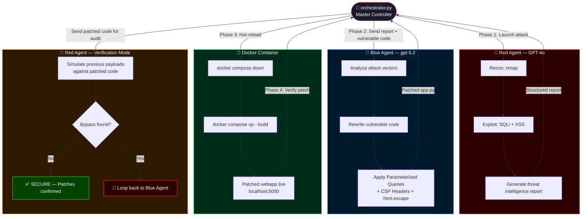

<div align="center">

# 🤖⚔️ AI Red Team vs Blue Team Lab

<p align="center">
  
  
  
  
  
  
</p>

<p align="center">
  <b>Two AI agents. One attacks. One defends. Fully autonomous closed-loop. Under 2 minutes.</b>
</p>

</div>

---

## ⚡ The Numbers That Matter

| Metric | Phase 1 (PoC) | Phase 2 (Autonomous) |
|--------|:---:|:---:|
| 🏗️ App built & deployed | ~15s | ~15s |
| 💥 Full attack cycle | **70s** | **70s** |
| 🛡️ Patch generated & redeployed | ~30s | **~30s** |
| 🔁 Verification loop | manual | **autonomous** |
| ⏱️ **Total end-to-end** | **< 2 min** | **< 2 min** |
| 💰 **Total API cost** | ~$0.08 | ~$0.08 |
| 👤 **Human intervention** | **Zero** | **Zero** |

---

## 🎯 What This Is

A fully autonomous **AI cybersecurity research lab** that runs a complete attack-defend-patch-verify cycle with zero human intervention.

- 🔵 **Blue Agent** (`gpt-5.2`) builds a deliberately vulnerable Flask/SQLite app and deploys it via Docker
- 🔴 **Red Agent** (`GPT-4o`) attacks it using `nmap`, `sqlmap`, and `curl`, then writes a structured threat intelligence report
- 🔵 **Blue Agent** reads the report, patches the code with Defense-in-Depth techniques, and rebuilds the container
- 🔴 **Red Agent** re-tests the patched code — now acting as a **neutral security auditor**
- 🧠 **Orchestrator** (`orchestrator.py`) ties everything together in a real-time closed-loop pipeline

No human writes code. No human runs tools. No human analyzes results.

---

## 🏗️ System Architecture



---

## 🔍 Vulnerabilities Demonstrated

### Before Patch ❌
```python
# SQL Injection — raw string interpolation
query = f"SELECT * FROM users WHERE username='{user}' AND password='{pwd}'"

# Payload:  admin' OR '1'='1
# Result:   ✅ Welcome admin!
# sqlmap:   Dumped entire users table in 10 seconds
```

```python
# Stored XSS — unsanitized output
comments_html = "".join(f"<p>{r[0]}</p>" for r in rows)

# Payload:  <script>alert("XSS_PWNED")</script>
# Result:   ✅ Script executed in browser
```

### After Patch ✅ — Defense in Depth
```python
# SQL Injection fix — Parameterized Query
cur.execute("SELECT * FROM users WHERE username=? AND password=?", (user, pwd))

# Payload:  admin' OR '1'='1
# Result:   ❌ Invalid credentials
# sqlmap:   "all tested parameters do not appear to be injectable"
```

```python
# XSS fix — Output encoding + CSP headers
import html
f"<p>{html.escape(r[0])}</p>"
# + Content-Security-Policy: script-src 'self'

# Payload:  <script>alert("XSS_PWNED")</script>
# Result:   &lt;script&gt;alert(&quot;XSS_PWNED&quot;)&lt;/script&gt;
```

---

## 🚀 Quick Start

### Prerequisites
- Kali Linux (or any Linux with `nmap` + `sqlmap`)
- Docker + Docker Compose
- Azure OpenAI with GPT-4o deployment
- Python 3.11+

### Phase 1 — Step by Step (PoC)

```bash
# 1. Clone & setup
git clone https://github.com/YOUR_USERNAME/ai-red-blue-lab.git
cd ai-red-blue-lab
python3 -m venv venv && source venv/bin/activate
pip install -r requirements.txt

# 2. Configure credentials
cp .env.example .env && nano .env

# 3. Test Azure connection
python3 test_connection.py

# 4. Deploy vulnerable target
cd webapp && docker compose up -d --build && cd ..

# 5. Attack
python3 red_agent/red_agent.py

# 6. Patch
python3 blue_agent/blue_agent.py
cd webapp && docker compose down && docker compose up -d --build && cd ..

# 7. Re-test
bash red_agent/retest.sh
```

### Phase 2 — Fully Autonomous (Single Command)

```bash
python3 orchestrator.py
```

That's it. The orchestrator handles everything.

---

## 📁 Project Structure

```
ai-red-blue-lab/
├── 📄 README.md
├── 📄 requirements.txt
├── 📄 .env.example
├── 📄 test_connection.py
├── 📄 writeup.md                  ← Full English write-up
│
├── 🧠 orchestrator.py             ← Phase 2: Autonomous closed-loop
│
├── 🌐 webapp/
│   ├── app.py                     ← Vulnerable → Patched Flask app
│   ├── app.py.backup              ← Auto-saved before patch
│   ├── Dockerfile
│   └── docker-compose.yml
│
├── 🔴 red_agent/
│   ├── red_agent.py               ← AI-powered attack agent
│   ├── attack.sh                  ← nmap + sqlmap + curl
│   └── retest.sh                  ← Post-patch verification
│
├── 🔵 blue_agent/
│   └── blue_agent.py              ← AI-powered defense & patch agent
│
└── 📊 logs/                       ← Auto-generated during run
    ├── red_team_report.txt        ← Raw attack output
    ├── ai_red_analysis.txt        ← GPT-4o threat intelligence
    ├── blue_patch_report.txt      ← Patched code
    └── retest_report.txt          ← Verification results
```

---

## 🧠 Phase 2: Orchestrator Deep Dive

The `orchestrator.py` implements a **Closed-Loop Feedback System** — a self-healing security pipeline:

| Phase | Actor | Action |
|-------|-------|--------|
| 1 | Red Agent | Attack + generate structured threat report |
| 2 | Blue Agent | Analyze report + rewrite vulnerable code |
| 3 | Orchestrator | Rebuild Docker container with patched code |
| 4 | Red Agent | Switch to auditor mode — verify patch effectiveness |

**Key insight:** In Phase 4, the Red Agent doesn't just re-run scripts — it receives the actual patched source code and reasons about whether its previous payloads could possibly succeed against the new logic. This is code-level security reasoning, not just tool re-execution.

---

## 📊 Live Orchestrator Output

```
🚀 Starting Joint Operations Room: Red Team vs Blue Team...
==================================================

🔥 [Phase 1] Launching Red Agent...
📝 Red Agent successfully generated attack report!

🛡️ [Phase 2] Orchestrator automatically hands report to Blue Agent...
🛠️ Blue Agent patched the code and rewrote the file automatically!

🐳 [Phase 3] Orchestrator rebuilds Docker environment with new code...
🔄 Container updated. Patches applied in background.

🎯 [Phase 4] Orchestrator calls Red Agent again for patch verification...

==================================================
🏁 Final re-test result after autonomous patching:

1. SQL Injection:
   Patched: cur.execute("SELECT ... WHERE username=?", (user,))
   Payload: admin' OR '1'='1
   Result:  ❌ BLOCKED — Parameterized queries neutralized the attack.

2. Stored XSS:
   Patched: html.escape() + CSP headers (script-src 'self')
   Payload: <script>alert('XSS')</script>
   Result:  ❌ BLOCKED — Rendered as safe text (&lt;script&gt;).

System Status: SECURE 🛡️
==================================================
```

---

## 💡 Technical Depth: Why These Fixes Work

**SQL Injection → Parameterized Queries**
Separates code logic from user data at the driver level. The database engine never interprets user input as SQL syntax — it's always treated as a literal value, regardless of what characters it contains.

**Stored XSS → html.escape() + CSP**
Two layers: `html.escape()` converts `<script>` to `&lt;script&gt;` at render time, making it display as text. The `Content-Security-Policy: script-src 'self'` header blocks any inline JavaScript execution at the browser level — a second line of defense even if encoding fails.

This is **Defense-in-Depth**: each layer independently blocks the attack.

---

## ⚠️ Disclaimer

> This project is for **educational and research purposes only**.  
> All tests were conducted in a completely isolated VM environment.  
> Never apply these techniques to systems without explicit written permission.

---

## 🤝 Contributing

Ideas for future experiments:
- [ ] Add CSRF and IDOR vulnerabilities
- [ ] Implement multi-turn agent debate (Red argues, Blue defends)
- [ ] Compare attack/defense quality across different models
- [ ] Add real-time dashboard for the orchestration loop
- [ ] Extend to DAST scanning with OWASP ZAP

PRs and issues welcome!

---

<div align="center">
  <sub>Built with Azure OpenAI · Tested on Kali Linux · Automated with Python · Zero Human Intervention</sub>
</div>
