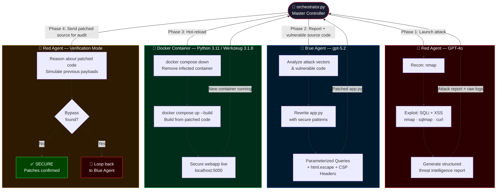

<div align="center">

# 🤖⚔️ AI Red Team vs Blue Team Lab

<p align="center">
  
  
  
  
  
  
</p>

<p align="center">
  <b>Two AI agents. Two different models. One attacks. One defends.<br/>
  Fully autonomous closed-loop. Under 2 minutes. ~$0.08.</b>
</p>

</div>

---

## ⚡ The Numbers That Matter

| Metric | Phase 1 (PoC) | Phase 2 (Autonomous) |
|--------|:---:|:---:|
| 🏗️ App built & deployed | ~15s | ~15s |
| 💥 Full attack cycle (nmap → SQLi → XSS) | **70s** | **70s** |
| 🛡️ Patch generated & redeployed | ~30s | **~30s** |
| 🔁 Verification loop | manual | **autonomous** |
| ⏱️ **Total end-to-end** | **< 2 min** | **< 2 min** |
| 💰 **Total API cost** | **~$0.08** | **~$0.08** |
| 👤 **Human intervention** | **Zero** | **Zero** |

---

## 🎯 What This Is

A fully autonomous **AI cybersecurity research lab** where two different AI models go head-to-head in a real attack-defend-patch-verify cycle.

- 🔴 **Red Agent** (`GPT-4o`) attacks using `nmap`, `sqlmap`, and `curl`, then writes a structured threat intelligence report
- 🔵 **Blue Agent** (`gpt-5.2`) builds the target app, reads the attack report, patches the vulnerabilities with Defense-in-Depth techniques, and rebuilds the container
- 🔴 **Red Agent** re-tests the patched code — switching roles to act as a **neutral security auditor**
- 🧠 **Orchestrator** (`orchestrator.py`) ties everything into a real-time closed-loop pipeline

**Key design decision:** Using two different models (GPT-4o vs gpt-5.2) creates genuine asymmetry — each model brings different reasoning patterns to its role, making the experiment more realistic and scientifically honest than a single model playing both sides.

---

## 🏗️ System Architecture



---

## 🚀 Quick Start

### Prerequisites
- Kali Linux (nmap + sqlmap pre-installed)
- Docker + Docker Compose
- Azure OpenAI resource with **two deployments**: GPT-4o and gpt-5.2
- Python 3.11+

### 1. Clone & Setup

```bash
git clone https://github.com/YOUR_USERNAME/ai-red-blue-lab.git
cd ai-red-blue-lab
python3 -m venv venv && source venv/bin/activate
pip install -r requirements.txt
```

### 2. Configure Credentials

```bash
cp .env.example .env
nano .env   # fill in your Azure keys and deployment names
python3 test_connection.py
# Expected output:
# 🔴 Red Agent (GPT-4o):  ✅ Connection successful. Tokens: 15
# 🔵 Blue Agent (gpt-5.2): ✅ Connection successful. Tokens: 16
```

### Phase 1 — Step by Step (PoC)

```bash
# Deploy vulnerable target
cd webapp && docker compose up -d --build && cd ..

# Attack
python3 red_agent/red_agent.py

# Patch
python3 blue_agent/blue_agent.py
cd webapp && docker compose down && docker compose up -d --build && cd ..

# Re-test
bash red_agent/retest.sh
```

### Phase 2 — Fully Autonomous (Single Command)

```bash
python3 orchestrator.py
```

---

## 📁 Project Structure

```
ai-red-blue-lab/
├── 📄 README.md                   ← you are here (includes full write-up)
├── 📄 requirements.txt
├── 📄 .env.example
├── 📄 test_connection.py          ← verify both model connections
├── 🧠 orchestrator.py             ← Phase 2: single-command autonomous loop
│
├── 🌐 webapp/
│   ├── app.py                     ← vulnerable → patched Flask app
│   ├── app.py.backup              ← auto-saved before patch
│   ├── Dockerfile                 ← Python 3.11-slim
│   └── docker-compose.yml
│
├── 🔴 red_agent/
│   ├── red_agent.py               ← GPT-4o powered attack + analysis
│   ├── attack.sh                  ← nmap + sqlmap + curl pipeline
│   └── retest.sh                  ← post-patch verification script
│
├── 🔵 blue_agent/
│   └── blue_agent.py              ← gpt-5.2 powered patch agent
│
└── 📊 logs/                       ← auto-generated during run
    ├── red_team_report.txt        ← raw attack output
    ├── ai_red_analysis.txt        ← GPT-4o threat intelligence
    ├── blue_patch_report.txt      ← patched source code
    ├── retest_report.txt          ← verification results
    └── sqlmap/                    ← sqlmap session + dumps
```

---

---

# 📖 Write-up: When AI Attacks Itself

> **Date:** June 22, 2026 · **Environment:** Kali Linux VM · Azure OpenAI · Docker  
> **Tags:** `AI Security` `Penetration Testing` `AppSec` `Autonomous Agents` `GPT-4o` `gpt-5.2`

---

## The Idea I Couldn't Get Out of My Head

What if two AI agents fought each other — one building and defending a web application, the other trying to break in? Two different models. No human intervention. No waiting. No typos in terminal commands.

I ran the experiment. The results were more interesting than I expected — not just because the attack and defense both worked, but because of **how fast everything happened**.

---

## The Setup

**Two models. Two roles. One isolated Kali Linux VM.**

| Agent | Model | Role |
|-------|-------|------|
| 🔴 Red Agent | GPT-4o (Azure OpenAI) | Attack, analyze findings, verify patch |
| 🔵 Blue Agent | gpt-5.2 (Azure OpenAI) | Build target app, patch vulnerabilities |

**Target stack:** Flask · SQLite · Werkzeug 3.1.8 · Python 3.11.15 · Docker

**Why two different models?** Using GPT-4o for offense and gpt-5.2 for defense creates genuine asymmetry — each model brings different reasoning patterns to its role. A single model playing both sides would produce biased results.

**A note on tooling:** We started with AutoGen for agent orchestration, but hit a library conflict — AutoGen's bundled `openai` v0.x clashed with the modern `openai` v1.x SDK. We scrapped it and called the Azure OpenAI API directly. Simpler, faster, no magic.

---

## Phase 1: Proof of Concept

### Act 1 — Blue Agent Builds the Target ⏱️ 15 seconds

Blue Agent (`gpt-5.2`) was given one instruction: build a Flask/SQLite web app, deploy it via Docker, and intentionally leave two vulnerabilities in it for the experiment.

**Vulnerability 1: SQL Injection**

```python
# ❌ User input injected directly into SQL query
query = f"SELECT * FROM users WHERE username='{user}' AND password='{pwd}'"
cur.execute(query)
```

**Vulnerability 2: Stored XSS**

```python
# ❌ Raw user input stored and rendered without sanitization
comments_html = "".join(f"<p>{r[0]}</p>" for r in rows)
```

The database was pre-seeded with two users: `admin:secret123` and `alice:pass456`.

From script execution to `Container vulnerable-webapp Started`: **15 seconds**.

```bash
$ curl -s http://localhost:5000/login | grep -o "<h2>.*</h2>"
<h2>Login</h2>   # ✅ App is live on port 5000
```

---

### Act 2 — Red Agent Attacks ⏱️ 70 seconds

Red Agent (`GPT-4o`) ran a four-phase attack script automatically.

**Phase 1 — Reconnaissance: nmap (6.38 seconds)**

```
PORT     STATE SERVICE VERSION
5000/tcp open  http    Werkzeug httpd 3.1.8 (Python 3.11.15)
```

Framework version fingerprinted. We know what we're dealing with.

**Phase 2 — Manual SQL Injection (< 1 second)**

```
Payload:  admin' OR '1'='1
Response: ✅ Welcome admin!
```

Login bypassed on the first attempt. Classic OR-based injection.

**Phase 3 — sqlmap Automated Scan (10 seconds)**

sqlmap automatically identified the backend as SQLite, then found **three injection techniques** on the same `username` parameter:

```
Type: boolean-based blind
Payload: username=admin' AND CASE WHEN 1348=1348 THEN 1348
         ELSE JSON(CHAR(69,74,90,69)) END AND 'xgKy'='xgKy

Type: time-based blind
Payload: username=admin' AND 7314=LIKE(CHAR(65,66,67,68,69,70,71),
         UPPER(HEX(RANDOMBLOB(500000000/2)))) AND 'fesM'='fesM

Type: UNION query (3 columns)
Payload: username=-5323' UNION ALL SELECT NULL,CHAR(113,120,112,107,113)
         ||CHAR(70,109,100,...)||CHAR(113,120,118,106,113),NULL-- qZAZ
```

Then dumped the entire users table — 100 HTTP requests total:

```
Database: SQLite_masterdb
Table: users
+----+-----------+----------+
| id | password  | username |
+----+-----------+----------+
| 1  | secret123 | admin    |
| 2  | pass456   | alice    |
+----+-----------+----------+
```

**Phase 4 — Stored XSS (< 1 second)**

```
Payload stored:   <script>alert("XSS_PWNED")</script>
Reflected back:   ✅ Script tag present — executes in any victim's browser
```

**Total: 70 seconds. 100 HTTP requests. Every credential stolen. XSS payload live.**

GPT-4o then analyzed its own attack output and produced a structured threat intelligence report:

| Vulnerability | Severity | Impact |
|---|---|---|
| SQL Injection | **Critical** | Full database compromise, authentication bypass |
| Stored XSS | **High** | Arbitrary JavaScript execution on all visitors |

*API cost for this analysis: 4,667 tokens — roughly $0.05.*

---

### Act 3 — Blue Agent Patches the Code ⏱️ 30 seconds

The GPT-4o threat report was passed directly to Blue Agent (`gpt-5.2`) along with the vulnerable `app.py`. No human read the report. No human wrote the fix.

**Fix 1: Parameterized Queries**

```python
# ✅ SQL logic and user data are now completely separated
cur.execute("SELECT * FROM users WHERE username=? AND password=?", (user, pwd))
```

The database driver handles escaping. User input is always treated as a literal value — never as SQL syntax.

**Fix 2: Output Encoding + CSP Header**

```python
# ✅ Special characters neutralized before rendering
import html
comments_html = "".join(f"<p>{html.escape(r[0])}</p>" for r in rows)
# + Content-Security-Policy: script-src 'self'  (added to response headers)
```

Blue Agent automatically saved a backup of the original file (`app.py.backup`), wrote the patched version, and the orchestrator triggered a Docker rebuild:

```bash
[+] Building 1.6s (11/11) FINISHED
✔ Container vulnerable-webapp  Started ✅
```

*API cost for patch generation: 2,561 tokens.*

---

### Act 4 — Red Agent Confirms the Fix ⏱️ 3 seconds

Same payloads. Same tools. Different result.

**SQL Injection — blocked**
```bash
Payload: admin' OR '1'='1
Result:  ❌ Invalid credentials
```

**sqlmap — full arsenal, nothing found**
```
[WARNING] POST parameter 'username' does not seem to be injectable
[WARNING] POST parameter 'password' does not seem to be injectable
[CRITICAL] all tested parameters do not appear to be injectable.
```

sqlmap tried everything. Boolean-based, time-based, UNION — all failed.

**Stored XSS — escaped**
```bash
Input:  <script>alert("XSS_PWNED")</script>
Output: &lt;script&gt;alert(&quot;XSS_PWNED&quot;)&lt;/script&gt;
```

Stored as plain text. Browser renders it, doesn't execute it.

**Legitimate login still works:**
```bash
username=admin&password=secret123  →  ✅ Welcome admin!
```

The patch didn't break anything.

| Vulnerability | Before Patch | After Patch |
|---|---|---|
| SQL Injection — manual | ❌ Exploited | ✅ Blocked |
| SQL Injection — sqlmap | ❌ Full DB dumped | ✅ Not injectable |
| Stored XSS | ❌ Script executed | ✅ Escaped to plain text |
| Legitimate login | ✅ Works | ✅ Still works |

---

## Phase 2: Fully Autonomous Closed-Loop

Phase 1 proved the concept with manual handoffs between steps. Phase 2 eliminated them entirely.

`orchestrator.py` connects both agents in a **Closed-Loop Feedback System** — a self-healing security pipeline that runs start-to-finish with a single command.

**The critical engineering decision in Phase 4:** Red Agent doesn't just re-run `attack.sh`. It receives the actual patched Python source code and *reasons* about whether its previous payloads could succeed against the new logic. This is code-level security analysis, not blind tool re-execution. The model has to understand why the patch works — or find a gap if it doesn't.

### Live Orchestrator Output

```
🚀 Starting Joint Operations Room: Red Team vs Blue Team...
==================================================

🔥 [Phase 1] Launching Red Agent (GPT-4o)...
📝 Red Agent successfully generated attack report!

🛡️ [Phase 2] Orchestrator hands report to Blue Agent (gpt-5.2)...
🛠️ Blue Agent patched the code and rewrote app.py automatically!

🐳 [Phase 3] Orchestrator rebuilds Docker with patched code...
🔄 Container updated. Secure version now live.

🎯 [Phase 4] Calling Red Agent for verification audit...

==================================================
🏁 Final Verification Report:

1. SQL Injection Analysis:
   Patched: cur.execute("SELECT ... WHERE username=?", (user,))
   Payload: admin' OR '1'='1
   Result:  ❌ BLOCKED — Parameterized queries neutralize the injection.

2. Stored XSS Analysis:
   Patched: html.escape() + Content-Security-Policy: script-src 'self'
   Payload: <script>alert('XSS')</script>
   Result:  ❌ BLOCKED — Rendered as &lt;script&gt;. CSP blocks inline JS.

System Status: SECURE 🛡️
==================================================
```

### Why the CSP Header Is the Interesting Part

Blue Agent applied **Defense-in-Depth** without being asked for it:

- Layer 1: `html.escape()` converts `<script>` → `&lt;script&gt;` at the Python level
- Layer 2: `Content-Security-Policy: script-src 'self'` tells the browser to refuse any inline JavaScript, even if it somehow gets through encoding

Both layers must fail simultaneously for XSS to succeed. The model reasoned about this independently — it wasn't in the prompt.

---

## The Complete Timeline

```
18:36:58  🔵 Blue Agent (gpt-5.2) builds app → Docker starts
          └── ~15 seconds

18:37:06  🔴 Red Agent (GPT-4o) begins attack
          ├── nmap: Werkzeug 3.1.8 / Python 3.11.15 fingerprinted (6.38s)
          ├── SQLi: login bypassed on first payload (<1s)
          ├── sqlmap: 3 injection types found, full DB dump (10s)
          └── XSS: payload stored and reflected (<1s)
          └── 70 seconds total · 100 HTTP requests

18:37:16  🤖 GPT-4o analyzes findings → structured threat report
          └── 1 API call · 4,667 tokens · ~$0.05

          🔵 gpt-5.2 reads report → patches app.py
          └── 1 API call · 2,561 tokens · ~$0.03

          🐳 Docker rebuild with patched code
          └── ~20 seconds (cached layers)

18:37:36  🔴 GPT-4o re-tests patched app
          └── sqlmap: not injectable · XSS: escaped · 3 seconds

──────────────────────────────────────────────────────────
⏱️  Full cycle, start to finish:  < 2 minutes
💰  Total Azure OpenAI cost:      ~$0.08
👤  Human intervention:           zero
```

---

## What This Actually Means

**Speed is the real shift.**
What traditionally takes days — Red Team engagement, developer reads report, writes fix, gets it reviewed, deploys — happened in under two minutes. Not because AI is smarter than a human security engineer. Because it doesn't stop, doesn't need context-switching, and doesn't wait for a Slack reply.

**Two models beat one.**
GPT-4o on offense and gpt-5.2 on defense created genuine asymmetry. The experiment would have been less honest — and less interesting — with a single model playing both sides.

**Ditch the framework when it fights you.**
AutoGen looked good on paper. When its bundled openai v0.x clashed with our openai v1.x, we spent zero time debugging it and just called the API directly. Sometimes the abstraction isn't worth it.

**AI doesn't invent, it compresses.**
SQL Injection is in OWASP Top 10. sqlmap is public. Parameterized queries are documented everywhere. What AI did here was collapse the time between *knowing* and *doing* — from days to seconds.

**The real implication.**
If an attacker can automate a full recon-exploit-report cycle in 70 seconds for $0.05, the defender's response window shrinks to something only automation can match. This experiment is a small demonstration of that pressure.

---

## What's Next

- [ ] Add CSRF and IDOR to the target app and repeat
- [ ] Test whether Red Agent can find vulnerabilities it wasn't told about
- [ ] Pit GPT-4o vs gpt-5.2 in both roles and compare outcomes
- [ ] Build a real-time terminal dashboard for the orchestration loop
- [ ] Extend to DAST scanning with OWASP ZAP

---

## ⚠️ Disclaimer

> This project is for **educational and research purposes only**.  
> All tests were conducted in a completely isolated VM environment.  
> Never use these techniques on systems without explicit written permission.

---

## 🤝 Contributing

Contributions are welcome — here are concrete ideas:

**🔴 Red Team**
- Add CSRF, IDOR, Path Traversal, Command Injection attack modules
- Integrate OWASP ZAP for deeper automated scanning
- Make Red Agent discover vulnerabilities without being told what to look for

**🔵 Blue Agent**
- Compare patch quality across different models
- Add automatic rollback if the patched app fails a smoke test
- Implement WAF rule generation alongside code fixes

**🧠 Orchestrator**
- Real-time terminal dashboard (`rich` / `textual`)
- True feedback loop: if Red Agent finds a bypass → automatically re-engage Blue Agent
- Per-phase token usage and cost logging

**📊 Research**
- Benchmark GPT-4o vs other models on attack effectiveness
- Measure patch quality: over-patch vs under-patch vs correct
- Test on a more complex multi-service application

```bash
git checkout -b feature/your-idea
git commit -m "feat: your improvement"
git push origin feature/your-idea
# then open a Pull Request — direct pushes to main are blocked
```

Found a bug or have an idea? [Open an issue](https://github.com/YOUR_USERNAME/ai-red-blue-lab/issues)

---

<div align="center">
  <sub>
    🔴 GPT-4o attacks · 🔵 gpt-5.2 defends · 🧠 Python orchestrates · 🐳 Docker isolates · ⏱️ 2 minutes total
  </sub>
</div>
