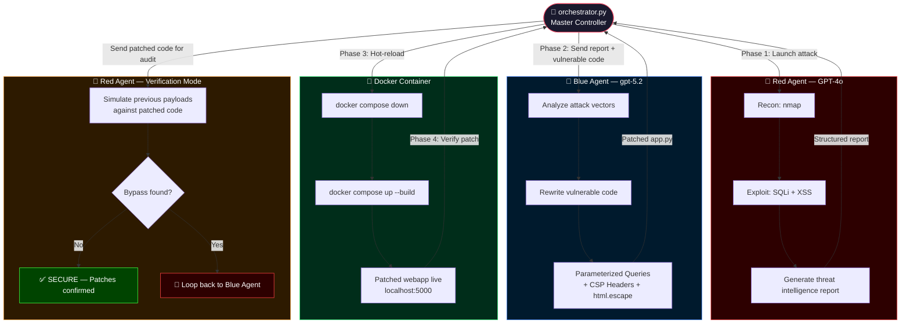

<div align="center">

# 🤖⚔️ AI Red Team vs Blue Team Lab

<p align="center">
  
  
  
  
  
  
</p>

<p align="center">
  <b>Two AI agents. One attacks. One defends. Fully autonomous closed-loop. Under 2 minutes.</b>
</p>

</div>

---

## ⚡ The Numbers That Matter

| Metric | Phase 1 (PoC) | Phase 2 (Autonomous) |
|--------|:---:|:---:|
| 🏗️ App built & deployed | ~15s | ~15s |
| 💥 Full attack cycle | **70s** | **70s** |
| 🛡️ Patch generated & redeployed | ~30s | **~30s** |
| 🔁 Verification loop | manual | **autonomous** |
| ⏱️ **Total end-to-end** | **< 2 min** | **< 2 min** |
| 💰 **Total API cost** | ~$0.08 | ~$0.08 |
| 👤 **Human intervention** | **Zero** | **Zero** |

---

## 🎯 What This Is

A fully autonomous **AI cybersecurity research lab** that runs a complete attack-defend-patch-verify cycle with zero human intervention.

- 🔵 **Blue Agent** (`gpt-5.2`) builds a deliberately vulnerable Flask/SQLite app and deploys it via Docker
- 🔴 **Red Agent** (`GPT-4o`) attacks it using `nmap`, `sqlmap`, and `curl`, then writes a structured threat intelligence report
- 🔵 **Blue Agent** reads the report, patches the code with Defense-in-Depth techniques, and rebuilds the container
- 🔴 **Red Agent** re-tests the patched code — now acting as a **neutral security auditor**
- 🧠 **Orchestrator** (`orchestrator.py`) ties everything together in a real-time closed-loop pipeline

---

## 🏗️ System Architecture



---

## 🚀 Quick Start

### Prerequisites
- Kali Linux (or any Linux with `nmap` + `sqlmap`)
- Docker + Docker Compose
- Azure OpenAI with GPT-4o deployment
- Python 3.11+

### Phase 1 — Step by Step (PoC)

```bash
git clone https://github.com/YOUR_USERNAME/ai-red-blue-lab.git
cd ai-red-blue-lab
python3 -m venv venv && source venv/bin/activate
pip install -r requirements.txt
cp .env.example .env && nano .env
python3 test_connection.py
cd webapp && docker compose up -d --build && cd ..
python3 red_agent/red_agent.py
python3 blue_agent/blue_agent.py
cd webapp && docker compose down && docker compose up -d --build && cd ..
bash red_agent/retest.sh
```

### Phase 2 — Fully Autonomous

```bash
python3 orchestrator.py
```

---

## 📁 Project Structure

```
ai-red-blue-lab/
├── 📄 README.md
├── 📄 requirements.txt
├── 📄 .env.example
├── 📄 test_connection.py
├── 🧠 orchestrator.py             ← Phase 2: single command
├── 🌐 webapp/
│   ├── app.py
│   ├── Dockerfile
│   └── docker-compose.yml
├── 🔴 red_agent/
│   ├── red_agent.py
│   ├── attack.sh
│   └── retest.sh
├── 🔵 blue_agent/
│   └── blue_agent.py
└── 📊 logs/                       ← auto-generated
```

---

---

# 📖 Write-up: When AI Attacks Itself

> **Date:** June 22, 2026 · **Tags:** AI Security · Penetration Testing · AppSec · Autonomous Agents

---

## The Idea I Couldn't Get Out of My Head

What if two AI agents fought each other — one building and defending a web application, the other trying to break in? No human intervention. No waiting. No typos in terminal commands.

I ran the experiment. The results were more interesting than I expected — not just because the attack and defense both worked, but because of **how fast everything happened**.

---

## Phase 1: Proof of Concept

### The Setup

| Agent | Model | Role |
|-------|-------|------|
| 🔵 Blue Agent | gpt-5.2 | Build target, patch vulnerabilities |
| 🔴 Red Agent | GPT-4o | Attack, analyze, re-test |

Target: a Flask/SQLite web app inside Docker, intentionally built with two classic vulnerabilities.

---

### Act 1 — Blue Agent Builds the Target ⏱️ 15 seconds

**Vulnerability 1: SQL Injection**

```python
# ❌ Raw string interpolation
query = f"SELECT * FROM users WHERE username='{user}' AND password='{pwd}'"
cur.execute(query)
```

**Vulnerability 2: Stored XSS**

```python
# ❌ Unsanitized output
comments_html = "".join(f"<p>{r[0]}</p>" for r in rows)
```

From script execution to `Container vulnerable-webapp Started`: **15 seconds**.

---

### Act 2 — Red Agent Attacks ⏱️ 70 seconds

**Recon — nmap (6 seconds)**
```
PORT     STATE SERVICE VERSION
5000/tcp open  http    Werkzeug httpd 3.1.8 (Python 3.11.15)
```

**Manual SQL Injection (< 1 second)**
```
Payload:  admin' OR '1'='1
Response: ✅ Welcome admin!
```

**sqlmap automated scan (10 seconds)**

Three injection techniques found on the same parameter:
```
- boolean-based blind
- time-based blind
- UNION query
```

Full database dumped:
```
+----+-----------+----------+
| id | password  | username |
+----+-----------+----------+
| 1  | secret123 | admin    |
| 2  | pass456   | alice    |
+----+-----------+----------+
```

**Stored XSS (< 1 second)**
```
Payload: <script>alert("XSS_PWNED")</script>
Result:  ✅ Stored and reflected — executes in browser
```

**Total: 70 seconds. 100 HTTP requests. Every credential stolen.**

GPT-4o then analyzed its own findings:

| Vulnerability | Severity | Impact |
|---|---|---|
| SQL Injection | **Critical** | Full database compromise |
| Stored XSS | **High** | Arbitrary JS execution on victims |

*Cost: 4,667 tokens — roughly $0.05.*

---

### Act 3 — Blue Agent Patches the Code ⏱️ 30 seconds

The attack report was passed directly to Blue Agent with the vulnerable source. No human summarized anything.

**Fix 1: Parameterized Queries**
```python
# ✅ User input never touches SQL syntax
cur.execute("SELECT * FROM users WHERE username=? AND password=?", (user, pwd))
```

**Fix 2: Output Encoding + CSP**
```python
# ✅ Neutralized at render time
import html
comments_html = "".join(f"<p>{html.escape(r[0])}</p>" for r in rows)
# + Content-Security-Policy: script-src 'self'
```

Docker rebuilt in the background. *Cost: 2,561 tokens.*

---

### Act 4 — Red Agent Confirms the Fix ⏱️ 3 seconds

```bash
Payload: admin' OR '1'='1        →  ❌ Invalid credentials
sqlmap full scan                  →  "all tested parameters do not appear to be injectable"
<script>alert("XSS_PWNED")</script>  →  &lt;script&gt;alert(&quot;XSS_PWNED&quot;)&lt;/script&gt;
```

| Vulnerability | Before | After |
|---|---|---|
| SQL Injection (manual) | ❌ Exploited | ✅ Blocked |
| SQL Injection (sqlmap) | ❌ Full DB dump | ✅ Not injectable |
| Stored XSS | ❌ Executed | ✅ Escaped |
| Legitimate login | ✅ Works | ✅ Still works |

---

## Phase 2: Fully Autonomous Closed-Loop

Phase 1 proved the concept. Phase 2 eliminated the last traces of human involvement.

`orchestrator.py` connects both agents in a real-time feedback loop. The critical engineering decision: in the verification phase, Red Agent doesn't re-run shell commands — it receives the actual patched Python source and **reasons** about whether its previous payloads could succeed against the new logic. Security reasoning, not tool re-execution.

### Live Output

```
🚀 Starting Joint Operations Room: Red Team vs Blue Team...

🔥 [Phase 1] Launching Red Agent...
📝 Red Agent successfully generated attack report!

🛡️ [Phase 2] Orchestrator hands report to Blue Agent...
🛠️ Blue Agent patched the code and rewrote the file automatically!

🐳 [Phase 3] Orchestrator rebuilds Docker with new code...
🔄 Container updated.

🎯 [Phase 4] Calling Red Agent for verification...

==================================================
1. SQL Injection → ❌ BLOCKED (Parameterized queries)
2. Stored XSS    → ❌ BLOCKED (html.escape + CSP)

System Status: SECURE 🛡️
==================================================
```

### Why the CSP Header Matters

Blue Agent added two independent layers without being asked:

- `html.escape()` converts `<script>` to `&lt;script&gt;` — display as text
- `Content-Security-Policy: script-src 'self'` — browser refuses all inline JS

Both must fail simultaneously for the attack to succeed. That's **Defense-in-Depth** — and the model applied it unprompted.

---

## The Complete Timeline

```
18:36:58  🔵 Blue Agent builds app → Docker starts         ~15s
18:37:06  🔴 Red Agent attacks
           ├── nmap: Werkzeug 3.1.8 fingerprinted
           ├── SQLi: login bypassed on first payload
           ├── sqlmap: full DB dump in 10 seconds
           └── XSS: stored successfully               ~70s total
18:37:16  🤖 GPT-4o threat analysis                   1 call · 4,667 tokens
          🔵 Blue Agent patches code                  1 call · 2,561 tokens
          🐳 Docker rebuild                           ~20s
19:44:16  🔴 Re-test: everything blocked              3s
─────────────────────────────────────────────────────────
⏱️  Full cycle: < 2 minutes
💰  Total cost: ~$0.08
👤  Human intervention: zero
```

---

## What This Actually Means

**Speed is the real shift.**
What traditionally takes days between a Red Team report and a deployed fix happened in under two minutes. Not because AI is smarter than a human engineer — because it doesn't stop.

**Two models beat one.**
GPT-4o for attack and gpt-5.2 for defense created genuine asymmetry. Each model brought different reasoning to its role.

**AI doesn't invent, it compresses.**
OWASP Top 10 vulnerabilities. Public tools. Documented fixes. AI collapsed the time between knowing and doing.

**The real implication.**
If an attacker automates a full recon-exploit-report cycle in 70 seconds, the defender's response window shrinks to something only automation can match.

---

## What's Next

- [ ] Add CSRF and IDOR vulnerabilities and repeat
- [ ] Test whether Red Agent finds vulnerabilities it wasn't told about
- [ ] Pit different models against each other and measure outcomes
- [ ] Build a real-time dashboard for the orchestration loop

---

> *All tests conducted in a completely isolated VM environment. Never apply these techniques to systems without explicit written permission.*

---

## ⚠️ Disclaimer

> This project is for **educational and research purposes only**.  
> All tests were conducted in a completely isolated VM environment.  
> Never use these techniques on systems without explicit written permission.

---

## 🤝 Contributing

Contributions are welcome! Here are some ideas to get you started:

**🔴 Red Team improvements**
- Add more attack vectors: CSRF, IDOR, Path Traversal, Command Injection
- Integrate OWASP ZAP for deeper automated scanning
- Make Red Agent discover vulnerabilities it wasn't told about

**🔵 Blue Agent improvements**
- Test different models and compare patch quality
- Add automatic rollback if patched app breaks functionality
- Implement multi-layer defense suggestions (WAF rules, rate limiting)

**🧠 Orchestrator improvements**
- Add a real-time terminal dashboard (rich / textual)
- Implement a true loop: if Red Agent finds a bypass, send back to Blue Agent automatically
- Log token usage and cost per phase for benchmarking

**📊 Research directions**
- Benchmark GPT-4o vs other models in attack effectiveness
- Measure patch quality: does the model over-patch or under-patch?
- Test against a more complex multi-page app

**To contribute:**
```bash
# 1. Fork the repo
# 2. Create your branch
git checkout -b feature/your-idea

# 3. Commit and push
git commit -m "feat: your improvement"
git push origin feature/your-idea

# 4. Open a Pull Request
```

Found a bug or have an idea? [Open an issue](https://github.com/YOUR_USERNAME/ai-red-blue-lab/issues) — all feedback is appreciated.

---

<div align="center">
  <sub>Built with Azure OpenAI · Tested on Kali Linux · Automated with Python · Zero Human Intervention</sub>
</div>
