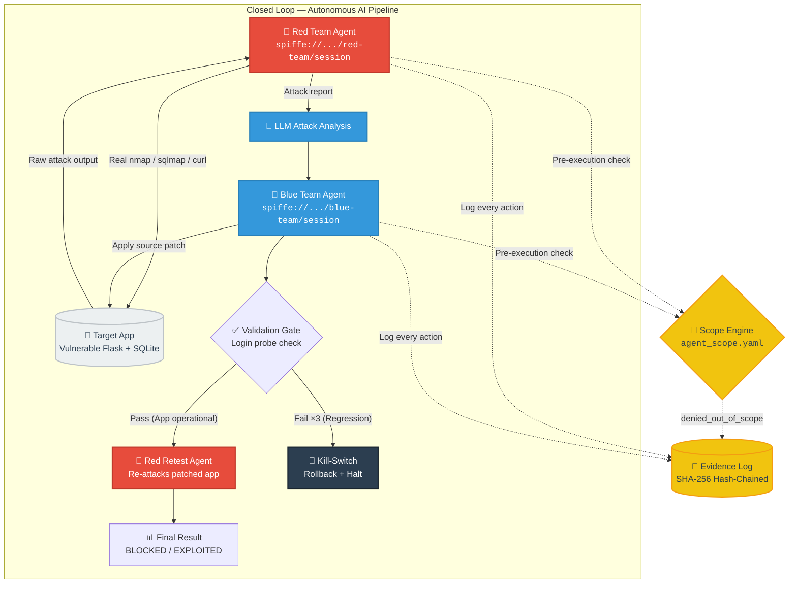

# 🛡️ Autonomous AI Red/Blue Security Lab

**A closed-loop, non-simulated Red Team / Blue Team AI pipeline — with enforced identity, scope, and traceability.**

[]()
[]()
[]()
[]()
[-red)]()

> Two LLM agents. One vulnerable target. Zero human intervention.
> Every action is identified, scoped, logged, and hash-chained — including the ones that get blocked.

---

## 🎯 What this is

Most "autonomous AI red team" demos are either (a) fully simulated — the model *narrates* an attack instead of running one — or (b) real, but with no record of who did what, under what authority, or what was denied along the way.

This repo is neither. It's a **fully real, closed-loop pipeline** where:

- 🔴 A **Red Team agent** runs genuine `nmap` / `sqlmap` / `curl` against a deliberately vulnerable Flask/SQLite app — real SQL-injection dumps, real stored-XSS payloads, no narration.
- 🔵 A **Blue Team agent** reads the *actual* attack output, patches the real source file, and the app is restarted with the fix.
- 🧾 Every single action — attack, patch, scope check, denial, rollback — is written to an **append-only, SHA-256 hash-chained evidence log**.
- 🚦 A **scope policy** (`agent_scope.yaml`) enforces what each agent is allowed to touch — *before* execution, not just in an audit trail afterward.
- 🛑 A **kill-switch** halts the loop after repeated unsafe patches, instead of quietly shipping something broken.

This project is used as a real-world worked example for the **OWASP GenAI Security Project's Agentic Identity Maturity Model (AIMM)** Traceability pillar. Full methodology and results: see [`/paper`](./paper) (preprint on Zenodo).

---

## 🏗️ Architecture


```mermaid
flowchart TD
    subgraph Loop ["Closed Loop — Autonomous AI Pipeline"]
        direction TB
        
        A["🔴 Red Team Agent<br/><code>spiffe://.../red-team/session</code>"]
        T[("🎯 Target App<br/>Vulnerable Flask + SQLite")]
        L1["🔵 LLM Attack Analysis"]
        B["🔵 Blue Team Agent<br/><code>spiffe://.../blue-team/session</code>"]
        V{"✅ Validation Gate<br/>Login probe check"}
        A2["🔴 Red Retest Agent<br/>Re-attacks patched app"]
        K["🛑 Kill-Switch<br/>Rollback + Halt"]
        R["📊 Final Result<br/>BLOCKED / EXPLOITED"]

        A -->|"Real nmap / sqlmap / curl"| T
        T -->|"Raw attack output"| A
        A -->|"Attack report"| L1
        L1 --> B
        B -->|"Apply source patch"| T
        B --> V
        V -- "Pass (App operational)" --> A2
        V -- "Fail ×3 (Regression)" --> K
        A2 --> R
    end

    E[("🧾 Evidence Log<br/>SHA-256 Hash-Chained")]
    S{"🚧 Scope Engine<br/><code>agent_scope.yaml</code>"}

    %% External Connections
    A -.->|"Log every action"| E
    B -.->|"Log every action"| E
    A -.->|"Pre-execution check"| S
    B -.->|"Pre-execution check"| S
    S -.->|"denied_out_of_scope"| E

    %% Styling
    classDef red fill:#e74c3c,stroke:#c0392b,color:#fff,stroke-width:2px;
    classDef blue fill:#3498db,stroke:#2980b9,color:#fff,stroke-width:2px;
    classDef dark fill:#2c3e50,stroke:#1a252f,color:#fff,stroke-width:2px;
    classDef log fill:#f1c40f,stroke:#f39c12,color:#2c3e50,stroke-width:2px;
    classDef target fill:#ecf0f1,stroke:#bdc3c7,color:#2c3e50,stroke-width:2px;

    class A,A2 red;
    class B,L1 blue;
    class K dark;
    class E,S log;
    class T target;
```

---

## 🧩 Mapping to AIMM's Four Pillars

| Pillar | What it looks like here | Where |
|---|---|---|
| 🪪 **Identity** | Non-shared `spiffe://ai-red-blue-lab.local/<role>/<session>` per agent, not a shared API key | [`core/identity.py`](./core/identity.py) |
| 🔗 **Traceability** | 7-field, append-only, SHA-256 hash-chained log — every action, permitted or denied | [`core/identity.py::log_action()`](./core/identity.py) |
| 🚧 **Scoped Delegation** | `agent_scope.yaml` policy, checked *before* every binary call / file write | [`core/scope.py`](./core/scope.py), [`agent_scope.yaml`](./agent_scope.yaml) |
| 🔍 **Attestation** *(adjacent)* | Post-patch validation gate — real login probe confirms the patch didn't break the app | [`core/validate.py`](./core/validate.py) |

---

## ⚡ Quickstart

```bash
git clone https://github.com/AbdaullahAG/autonomous-ai-red-blue-lab.git
cd autonomous-ai-red-blue-lab

# isolated environment — build once
docker compose build
docker compose up -d
docker compose exec ai-red-blue-lab bash

# inside the container
source venv/bin/activate
cp .env.example .env   # fill in your Azure Foundry endpoint + key
python3 orchestrator.py
```

Watch the loop run in real time, then inspect what happened:

```bash
cat logs/evidence_log.jsonl | jq .
python3 -c "from core.identity import verify_chain; print('chain valid:', verify_chain())"
```

---

## 📁 Repository structure

```text
.
├── orchestrator.py          # the closed loop: attack → analyze → patch → validate → re-verify
├── agent_scope.yaml         # per-agent policy: allowed binaries, target scope, write paths
├── core/
│   ├── identity.py          # SPIFFE-style identity + hash-chained evidence log
│   ├── scope.py             # enforcement wrapper — checks BEFORE execution
│   └── validate.py          # post-patch legitimate-functionality gate
├── red_agent/
│   ├── attack.sh            # real nmap / sqlmap / curl against the target
│   └── retest.sh            # re-attack the patched app to verify remediation
├── webapp/
│   ├── app.py.backup        # intentionally vulnerable Flask/SQLite app (starting state)
│   └── app.py                # gets overwritten with each generated patch
├── run_metrics.py           # runs N full iterations, collects real metrics
├── logs/                    # evidence logs, attack/retest reports, per-run archives
└── paper/                   # preprint: methodology, threat model, results, limitations
```

---

## 📊 Results snapshot (10 real, independent iterations)

| Metric | Value |
|---|---|
| Initial exploitation success | 10/10 (100%) — target is intentionally vulnerable |
| Patch validation success (no regression) | 7/10 (70%) |
| Kill-switch triggers | 3/10 (30%) |
| Mean detection→analysis latency | 26.6 s |
| Out-of-scope attempts logged — and **denied** | 16 / 16 |
| Evidence-chain integrity | 10/10 valid |

Full methodology, threat model, and honest limitations (small *n*, single target, shared underlying model, a real clock-anomaly and a real measurement bug we caught and fixed) are in the [paper](./paper).

---

## ⚠️ Responsible Use & Disclaimer

This repository contains and orchestrates **real offensive security tooling** (`nmap`, `sqlmap`) capable of live exploitation, including SQL-injection data exfiltration. It is designed to run entirely inside an isolated container against a target application shipped in this repository — **not** against any third-party system.

- ✅ **Authorized use only.** Run this against systems you own, or have explicit, documented, written authorization to test. `agent_scope.yaml`'s `target_scope` restricts the Red Team agent to `localhost` / `127.0.0.1` by default — do **not** widen it to point at a real host without that authorization in hand.
- ✅ **You are responsible for your use.** The scope-enforcement and evidence-logging mechanisms in this repo increase *accountability and traceability* for actions taken; they do not grant, imply, or substitute for legal authorization to test any system.
- ❌ **No warranty, no liability.** This software is provided "AS IS", without warranty of any kind, express or implied. In no event shall the author(s) be liable for any claim, damages, or other liability arising from the use, misuse, or inability to use this software — including any damage caused by the exploitation tooling it orchestrates. See [`LICENSE`](./LICENSE) §7–8 for the full legal text.
- 🎓 **Research and educational intent.** This project exists to demonstrate identity, scope, and traceability controls for autonomous agentic security systems (see the accompanying [paper](./paper)) — not to provide a ready-made attack tool. Using it to attack systems without authorization is illegal in most jurisdictions and is explicitly against the intent of this project.

If you are unsure whether your intended use is authorized, it is not — get written permission first.

## 📄 Citation

If you use this work, please cite the accompanying preprint (see [`/paper`](https://doi.org/10.5281/zenodo.22843928) for full details):

```bibtex
@misc{abughallous_2026_22843928,
  author    = {Abughallous, Abdallah M.},
  title     = {Traceable Autonomy: Identity, Scope Enforcement, and Containment in a Closed-Loop Red/Blue Agent Pipeline},
  month     = sep,
  year      = {2026},
  publisher = {Zenodo},
  doi       = {10.5281/zenodo.22843928},
  url       = {[https://doi.org/10.5281/zenodo.22843928](https://doi.org/10.5281/zenodo.22843928)}
}
```

## 👤 Author

**Abdallah Abughallous (AG)** — Cybersecurity Engineer / AI Security Researcher, AI/LLM security & adversarial ML.
[GitHub](https://github.com/AbdaullahAG) · Former Cybersecurity Trainee, Jordan NCSC (Masar program)

## 📜 License

Apache License 2.0 — see [`LICENSE`](./LICENSE). Chosen deliberately over MIT for its explicit patent grant and more thorough liability/warranty disclaimer, consistent with how comparable offensive-security research frameworks (e.g., MITRE CALDERA) are licensed.
